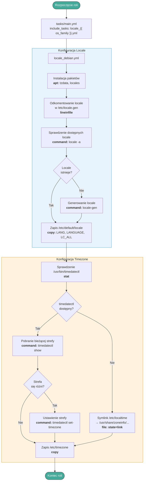

#  set-timezone

Rola Ansible konfigurująca strefę czasową i locale na systemach Debian/Ubuntu.

---
## Architektura

---
## Contributions
Jeśli masz pomysły na ulepszenia, zgłoś problemy, rozwidl repozytorium lub utwórz Merge Request. Wszystkie wkłady są mile widziane!
[Contributions](CONTRIBUTING.md)

---
## License
[Licencja](LICENSE) oparta na zasadach Creative Commons BY-NC-SA 4.0, dostosowana do potrzeb projektu.

---
# Author Information
### Maciej Rachuna
# 
